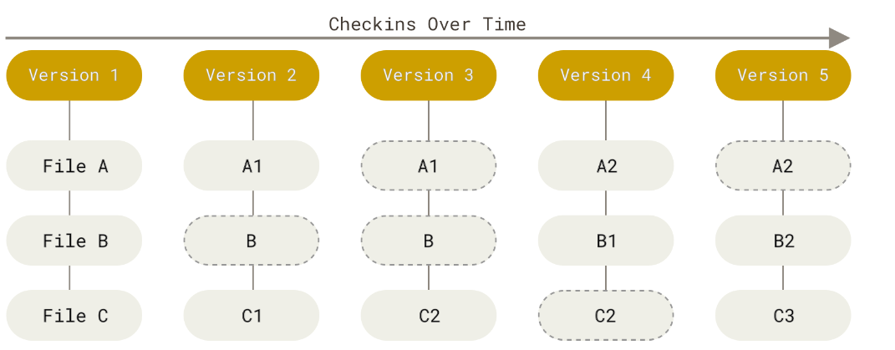
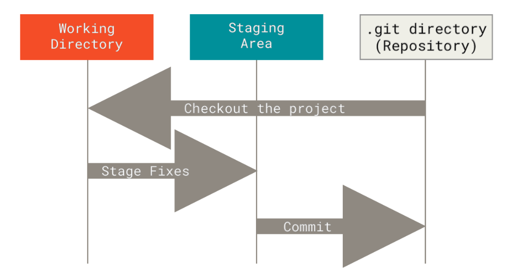
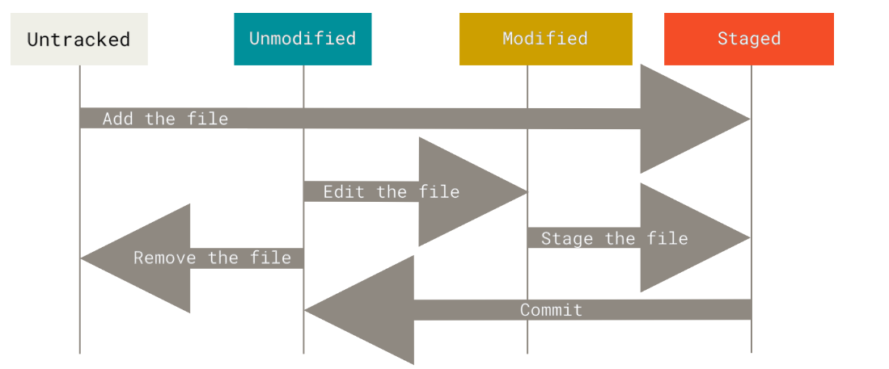
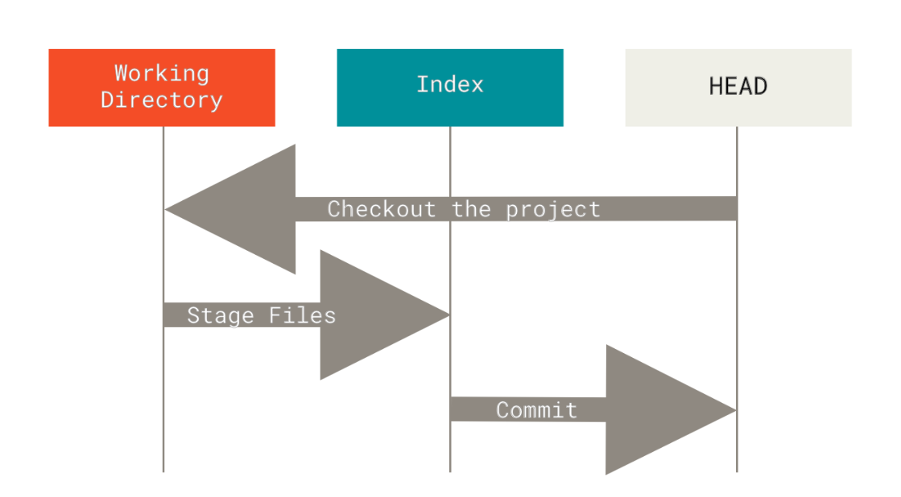

<h1 align="center"><strong> GIT AND GITHUB </Strong></h1>

#### GETTING STARTED :

---

##### VCS :

- A system that records the changes over time
- Stands for version control system
  ***
  ##### NEED OF VCS :
  - Revert selected files to the previous state
  - Revert the entire project to the previous state
  - comparing changes over time
  - Revert changes of teammates to rescue the project's bug
  - To restore the project from the remote server to rescue data loss or corrupt

---

##### TYPES OF VCS :

1. CVCS :

   - Stands for centralized VCS
   - Interact with the master or remote server

2. DVCS :

   - Stands for distributed VCS
   - Local repo : The mirror image of master
   - Interact with local repo and then master or remote server

   ##### DRAWBACKS AND BENEFITS :

   |     | CVCS                                                 | DVCS                       |
   | --- | ---------------------------------------------------- | -------------------------- |
   | 1   | Simple to understand                                 | Complex                    |
   | 2   | Entirely dependent on the internet                   | It is not                  |
   | 3   | Master corruption causes data loss if haven't backup | Have a mirror image System |

---

##### GIT : Nothing but a kind of VCS

- A distributed version control system to manage your GitHub repo from your computer
- Created by Linux Torvalds in 2005 in seven days

  ###### WORKING :

    

  ###### PROPERTIES :

  - No need for the internet : All changes happen locally
  - View changes locally
  - Make changes in the local repo
  - To upload the final changes come to need of internet

  ###### 3 STATES OF FILE IN GIT :

   

---

##### LIFE CYCLE OF GIT :

---

##### GIT SETUP :

- git --version : To configure
- GLOBAL : To set and show global credentials
  - SET :
    - git config --global user.name <name>
    - git config --global user.email <email>
    - git config --global user.password <password>
    ***
  - SHOW :
    - git config --global user.name
    - git config --global user.email
    - git config --global user.password
    ***
- LOCAL : To set and show local(current repo) credentials
  - SET :
    - git config user.name <name>
    - git config user.email <email>
    - git config user.password <password>
    ***
  - SHOW :
    - git config user.name
    - git config user.email
    - git config user.password
    ***

##### GITHUB :

- Remote platform
- git init : To initialize the git repo
- git add . : To stage
- git commit -m "commit" : To save in the local repo
- git branch -M <branch-name> : To change the branch name
- git add .; git commit -m "commit" : To Stage and Save
- git commit -am "commit" : To stage and save
- git status : To check status
- git log : To show all commit log
- git log -2 : To show the last two logs
- git remote add <url-name>(origin) url : To add the address of the remote platform
- git remote -v : To show
- git remote rm

---

##### CLONE :

- clone-> team
- clone-> changes-> push
- write access
- write access

---

##### OPEN SOURCE CONTRIBUTIONS:

- fork GitHub : To get a mirror image in your account to make some changes
- clone
- changes push to GitHub
- repo owner incorporate

---

##### .GITIGNORE : To ignore files and directory

- hello.txt : All hello.txt files
- /todo : Current Directory
- \*.a : all .a extension files
- \*.[ao] : all .a and .o extension files
- subDir/ : Directory and all its content
- l?b.?xt : which matches by replacing their character with ?

---

##### GIT RM :

- To remove the committed file from the working directory and staging area
- git rm : rm(terminal) + git add
- git rm <filename> : To remove and stage
- git rm -f <filename> : To force remove staged/modified/working directory file
- git rm --cached <filename> : To unstaged/unmodified from staged or modified

---

##### GIT AMMEND :

- To save changes at the last commit by replacing the last commit message without doing any extra commit
- **NOTE :** Work if the last commit is in the local repo if it has pushed to remote then doesn't work
- git commit --amend

---

##### GIT RESET HEAD :

- To send back from the staging area to modified
- git reset Head <filename>

---

##### GIT CHECKOUT AND STASH :

- To revert changes modified to unmodified which haven't been staged yet as it was in the last commit
- git checkout -- <filename> : To undo and doesn't support redo so can't retrieve changes
- git stash : To undo and support retrieval as well
- git stash pop : To redo as push and pop data-structure
- git stash clear : To clear the stash

---

##### GIT RESTORE :

- To revert from staging area to unstage and modified to unmodified
- git restore --staged <filename> : To revert to the last unstaged changes
- git restore <filename> : To revert to the last commit

---

##### GIT ALIASING :

- To assign a second name
- git config --global alias.aliasname "command-name"
- git config --global alias.stage "add"
- git config --global alias.save "commit"
- git config --global alias.unstage "reset Head"
- git config --global alias.last2 "log -2"

---

##### GIT BRANCH :

- git branch : To list all branches of the repo
- git branch <branch-name> : To create branch
- git checkout<branch-name> : To switch to the branch
- git checkout -b <branch-name> : To create and switch branch
- git merge <branch-name> : To merge branch
- git branch -d <branch-name> : To delete branch
- Beautify git log To show the branch as a graph
  - git log --all --decorate --oneline --graph

---

##### MERGE CONFLICT :

- More than one developer changes the same file in the same line

---

##### GIT FETCH :

- To bring remote changes to the local repo
- git fetch origin : To bring changes from origin to the local repo
- git merge : To bring changes from the local repo to the working directory
- git pull : git fetch origin + git merge

---

##### GIT REBASE :

- To obtain clean commit history and linear development
- git rebase <branch-name(main)> : To fast forwarding
- git rebase -i <branch-name(main)> : To obtain interactive rebase
- git merge <branch-name1(feature)> : To obtain fast forward merge
- rebase-> push ✔ push-> rebase ❌

---

##### FORK :

- To get a mirror image in your account to make some changes
- Fork
- change
- push
- open pull request

---

##### GIT RESET :

- To uncommitted
- git reset --soft Head~ : To get staged from committed
- git reset --mixed Head~ : To get untracked from committed
- git reset --hard Head~ : To delete from committed

  - GIT DIAGRAM :

    

---

##### GIT REVERT :

- To revert the certain commit
- git revert <commit-id> : Linear : To revert provided commit-id
- git revert -m 1 Head : Non-linear : To unmerge

---

##### GIT CHERRY PICK :

- git cherry pick <commit-id of another branch> : To pick and add commit of another branch

---

##### GIT REFLOG :

- To list all the changes and history
- git reflog
- git reset Head@{1} : To move to head1

---

##### GIT REBASE :

- To mend into the previous branch
- Pick and Squash
  - r-> edit
  - f-> discard
  - d-> drop
- git rebase -i

##### GIT DIFF :

- To show the modified files changes
- git diff <filename.txt> : To show Changes after modified
- git diff : To show changes in all files after modified
- git diff --staged <filename> : To show staged file changes
- git diff branch-name2..branch-name2 : To show the difference between branch1 and branch2
